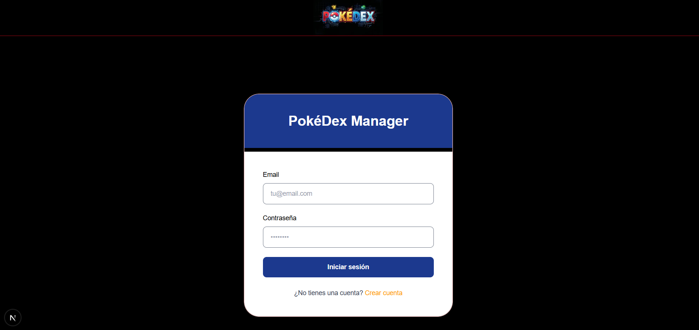
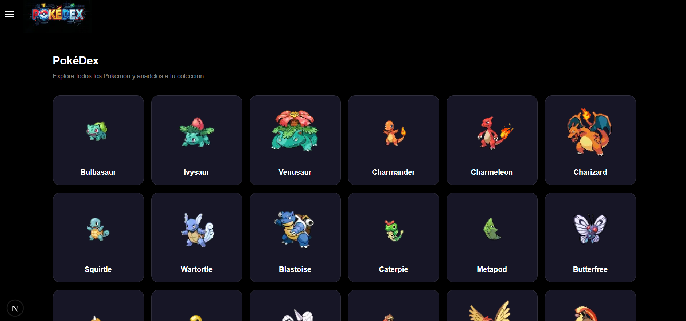
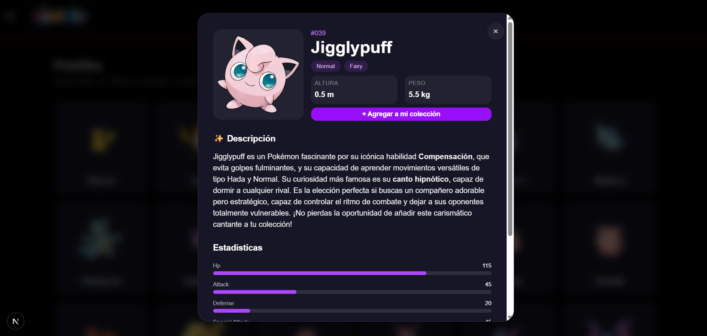
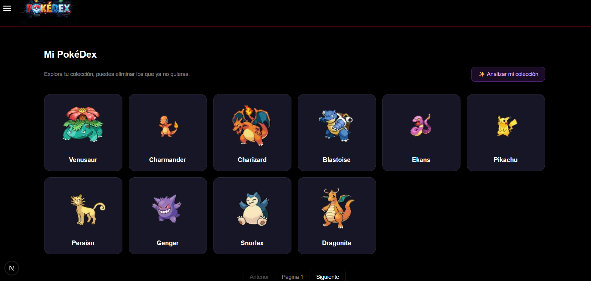
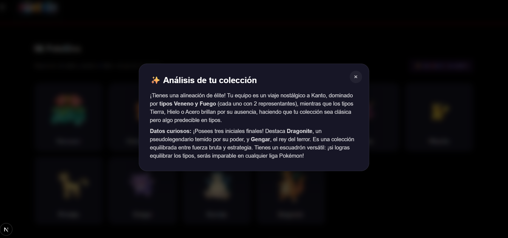
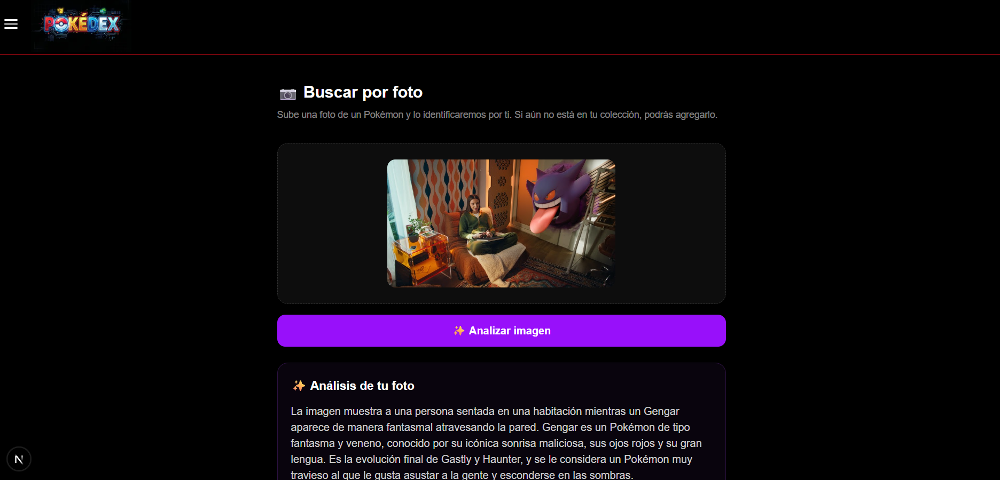

# Pokedex Manager

Aplicación web para gestionar una colección personal de Pokémon. Permite explorar la Pokédex, ver el detalle de cada Pokémon, añadirlo a tu colección y conocer curiosidades con ayuda de IA.

## Arquitectura

El proyecto es un monorepo dividido en dos aplicaciones independientes que se ejecutan por separado:

```
pokedex-manager/
├── backend/    API REST (Node.js + Express + TypeScript)
└── frontend/   Aplicación (Next.js + React)
```

- **Backend**: expone una API REST con Express. Usa Prisma como ORM sobre una base de datos MySQL. La autenticación se maneja con JWT y las contraseñas se almacenan utilizando hashes generados con bcrypt. Se decidió usar JWT por la simplicidad y la naturaleza del problema. Las integraciones de IA se realizan a través de Google Gemini, es necesario generar una API Key para su correcto funcionamiento.
- **Frontend**: aplicación Next.js que consume la API del backend mediante *server actions* y *route handlers*. La sesión del usuario se guarda en una cookie httpOnly y se valida en el middleware de Next.js antes de acceder a las rutas privadas. La interfaz está diseñada para adaptarse a dispositivos móviles, tablets y escritorio.

## Requisitos previos

- Node.js 20 o superior
- npm
- Un servidor MySQL corriendo localmente

## Configuración inicial

### 1. Crear la base de datos

Antes de ejecutar el backend, crea una base de datos vacía en tu servidor MySQL. Por ejemplo:

```sql
CREATE DATABASE pokedex;
```

### 2. Configurar las variables de entorno

Cada proyecto tiene su propio `.env.example`. Usarlo como referencia para llenar `.env` con los valores.

Para el backend 

`PORT` | Puerto en el que corre la API (por defecto `5200`).
`POKEDEX_URL` | Base de la PokeAPI pública, no necesita cambiarse.
`GEMINI_API_KEY` | API Key de Google Gemini, usada para las funcionalidades de IA.
`JWT_SECRET` | Secreto para firmar los tokens de sesión.
`JWT_EXPIRES_IN` | Tiempo de expiración del token (ej. `7d`).
`DATABASE_URL` | Cadena de conexión a la base de datos.

Para el frontend

`API_ENDPOINT` | URL base del backend.
`SESSION_COOKIE_NAME` | Nombre de la cookie donde se guarda el token de sesión.

### 3. Instalar dependencias

```bash
cd backend
npm install

cd ../frontend
npm install
```

### 4. Ejecutar las migraciones de Prisma

Con la base de datos creada y `DATABASE_URL` configurada, se generan las tablas ejecutando las migraciones:

```bash
cd backend
npm run db:migrate  o   npx prisma migrate dev
```

Esto creara las tablas de user y collection.

## Ejecutar el proyecto en desarrollo

Backend y frontend se ejecutan en procesos separados (dos terminales):

```bash
# Terminal 1 - Backend (http://localhost:5200)
cd backend
npm run dev
```

```bash
# Terminal 2 - Frontend (http://localhost:3000)
cd frontend
npm run dev
```

## Uso

1. Acceder al frontend en `http://localhost:3000`.
2. Crear una cuenta desde la pantalla de registro.
3. Iniciar sesión.
4. Explorar la Pokédex.
5. Seleccionar un Pokémon para consultar sus detalles.
6. Agregar Pokémon a la colección.
7. Consultar y administrar la colección personal.
8. Utilizar las funcionalidades de IA disponibles.
9. Utilizar la búsqueda mediante imágenes para identificar un Pokémon.

## Funcionalidades

La aplicación web cuenta con un sistema de inicio de sesión y registro que permite a cada usuario gestionar su propia colección de Pokémon. Una vez que el usuario ingresa, puede consultar todos los Pokémon disponibles y acceder a información relevante de cada uno mediante un click. Al seleccionar un Pokémon, además de visualizar sus características básicas, el usuario puede consultar una descripción generada mediante Gemini, que incorpora curiosidades y contexto adicional sobre el Pokémon.

El uso de inteligencia artificial en esta sección permite mostrar información en poco texto, haciendo que la consulta sea más atractiva y que el usuario pueda conocer aspectos que no se encuentran únicamente en los datos básicos. De esta manera, la IA funciona como un mecanismo de apoyo para que el usuario tenga más elementos al momento de decidir qué Pokémon desea agregar a su colección.

Dentro de la sección de colección, el usuario puede consultar todos los Pokémon que ha agregado hasta el momento y eliminarlos. Además, la aplicación incorpora una funcionalidad de análisis mediante ia, capaz de analizar la colección completa del usuario y generar un pequeño análisis sobre sus Pokémon, identificando características, patrones y curiosidades. Esto permite otorgar una experiencia donde la información de la colección es presentada de una forma interesante y curiosa, sin tener que ver todos los Pokémon que ha añadido.


Finalmente, hay una sección de búsqueda mediante imágenes. El usuario puede cargar una fotografía para identificar el Pokémon. Mediante Gemini, se analiza la imagen y determina si contiene un Pokémon. Si la imagen no corresponde a uno, el sistema solicita al usuario intentar nuevamente con otra fotografía. Si logra identificarlo, muestra un modal con la información del Pokémon, permitiendo agregarlo directamente a la colección, y también va a proporcionar un pequeño análisis relacionado con la imagen.

La IA fue implementada como una herramienta con distintas funcionalidades, desde generación de contenido, interpretación y análisis, personaliza la experiencia y permite que la información sea más dinámica y útil para el usuario de diferentes formas.


## Capturas de pantalla

### Login



### Pokédex / Todos los Pokémon



### Detalle de Pokémon



### Colección



### Análisis mediante IA



### Búsqueda mediante imagen


